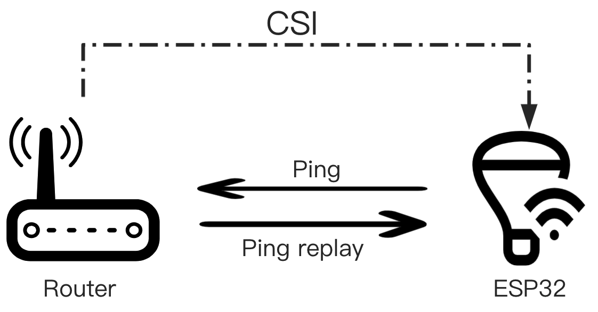
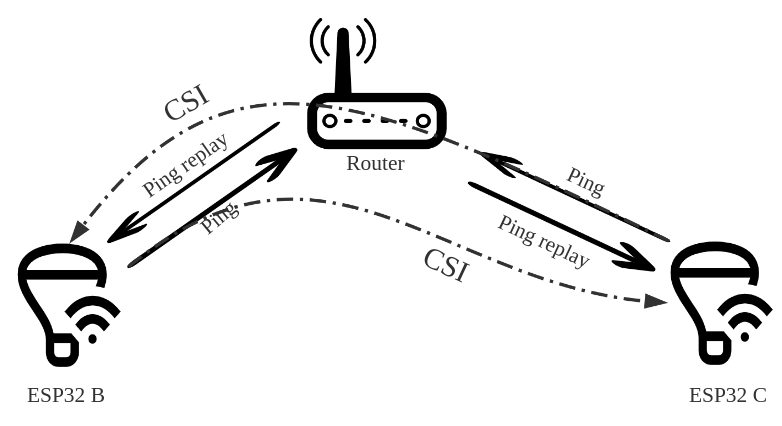
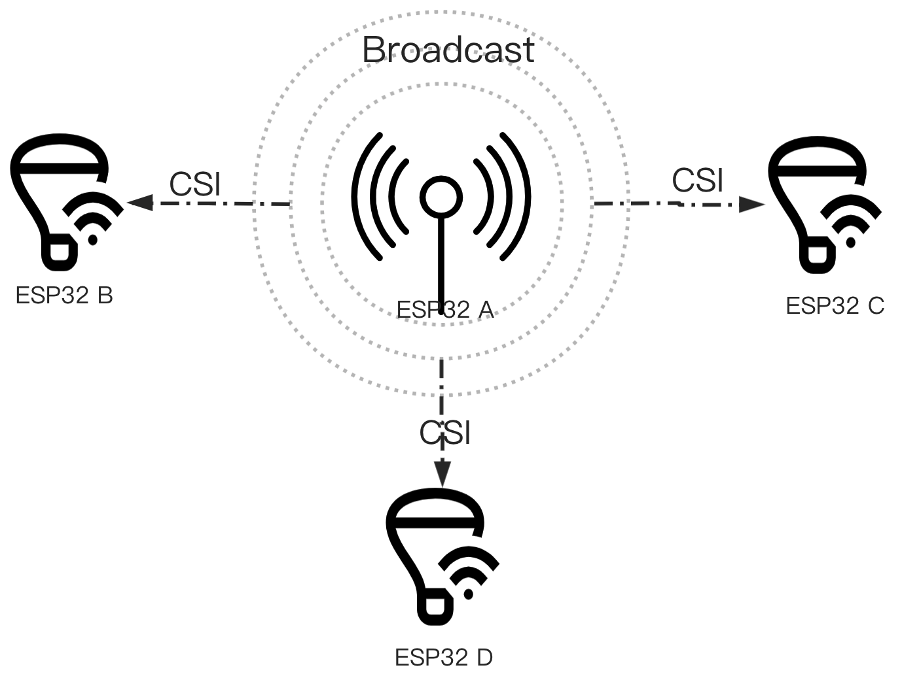

# CSI collection methods (ESP32-C5)

Aligned with Espressif’s **“How to get CSI”** in [`esp-csi/README.md`](esp-csi/README.md). Official diagrams:

| §4.1 Router | §4.2 Between devices | §4.3 Specific / broadcast |
|-------------|----------------------|---------------------------|
|  |  |  |

| Espressif | Name | Router / AP? | Example in this repo | Helper script |
|-----------|------|--------------|----------------------|---------------|
| **4.1** | Get **router** CSI | **Yes** | `csi_recv_router` | `set_csi_wifi.sh` · `monitor_csi.sh` |
| **4.2** | Get CSI **between devices** | **Yes** | `csi_between_devices` | `flash_csi_between.sh` |
| **4.3** | Get CSI from a **specific** sender | **No** (CSI link) | `csi_send` + `csi_recv` | `flash_csi_pair.sh` |

**Note on 4.3:** Espressif’s full §4.3 describes a dedicated multi-channel broadcaster. The get-started pair (`csi_send`/`csi_recv`) is the practical starter: fixed channel **11**, ESP‑NOW, sender MAC `1a:00:00:00:00:00` — same idea (CSI from a known sender), not the full channel-hopping product.

**Hardware:** ESP32-C5-KITC-A (PCB antenna). Ports: `/dev/cu.usbmodem*` or `/dev/cu.usbserial*`. Baud: **115200**.

**Plotter:** `./plot_csi.sh [port]` — not at the same time as monitor on that port.

---

## 4.1 — Get router CSI (one C5 + AP)

**Espressif:** ESP pings the router; CSI comes from the **ping reply**.

| | |
|---|---|
| Boards | 1× ESP32-C5 |
| Firmware | `esp-csi/examples/get-started/csi_recv_router` |
| Wi‑Fi | **Required** |
| CSI filter | AP BSSID |

```bash
./scripts/set_csi_wifi.sh 'YourSSID' 'YourPassword' [/dev/cu.usbmodem…]
./monitor_csi.sh /dev/cu.usbmodem…    # quit Ctrl+]
./plot_csi.sh /dev/cu.usbmodem…
```

---

## 4.2 — Get CSI between devices (two C5s + AP)

**Espressif:** Both ESPs ping the router; one measures CSI on frames **from the other ESP** (not from the router).

| | |
|---|---|
| Boards | 2× ESP32-C5 |
| Firmware | `esp-csi/examples/get-started/csi_between_devices` |
| Wi‑Fi | **Required** (same SSID) |
| Peer MAC | `1a:00:00:00:00:0a` |
| Sense | Promiscuous + filter that MAC |

```bash
# port1 = peer (traffic), port2 = sense (plot)
./scripts/flash_csi_between.sh 'YourSSID' 'YourPassword' [peer-port] [sense-port]
./plot_csi.sh <sense-port>
```

Expect `CSI_DATA,…,1a:00:00:00:00:0a,…` on the sense UART.

---

## 4.3 — Get CSI from a specific sender (two C5s, ESP‑NOW)

**Espressif (get-started form):** Dedicated sender; receiver takes CSI from that MAC. **No AP** for the CSI link.

| | |
|---|---|
| Boards | 2× ESP32-C5 |
| Firmware | `csi_send` + `csi_recv` |
| Wi‑Fi | **Not used** |
| Channel | 11, HT40 |
| Sender MAC | `1a:00:00:00:00:00` |

```bash
./scripts/flash_csi_pair.sh [send-port] [recv-port]
./plot_csi.sh <recv-port>
```

Place boards **> ~1 m** apart. (`monitor_csi.sh` / `set_csi_wifi.sh` are **4.1 only**.)

---

## Switching

| Go to | Run |
|-------|-----|
| **4.1** | `./scripts/set_csi_wifi.sh 'SSID' 'PASSWORD' [port]` |
| **4.2** | `./scripts/flash_csi_between.sh 'SSID' 'PASSWORD' [peer] [sense]` |
| **4.3** | `./scripts/flash_csi_pair.sh [send] [recv]` |

One firmware per board at a time.
