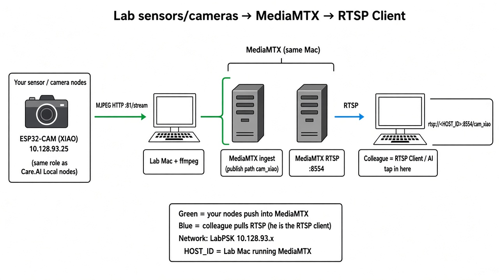

# MediaMTX (N× XIAO → Mini → RTSP)

```
N× CameraWebServerWiFi  http://<ip>:81/stream
        │
        ▼  ffmpeg on Mini (H.264)
MediaMTX :8554/cam_xiao, cam_xiao2, … cam_xiaoN
        │
        ▼
rtsp://10.128.93.23:8554/cam_xiao
rtsp://10.128.93.23:8554/cam_xiao2
…

N× Sense A/V (CameraWebServerWiFiSense):
  :81/stream (MJPEG) + :80/audio (s16le 16 kHz)
        │
        ▼  ffmpeg H.264 + AAC
MediaMTX :8554/cam_sense, cam_sense2, … cam_senseN
rtsp://10.128.93.23:8554/cam_sense
rtsp://10.128.93.23:8554/cam_sense2
…
```

ESP32-S3 has no HW H.264. Mini remuxes MJPEG (± PCM). Prefer **TCP** on LabPSK.



## Lab IPs

| Role | Address |
|------|---------|
| Mini (Ethernet / LabPSK) | `10.128.93.23` |
| XIAO (examples) | `10.128.93.25`, `10.128.93.34`, … |

## Prerequisites (Mini)

```bash
brew install mediamtx ffmpeg
```

Firmware:

- Video-only: **CameraWebServerWiFi** (`./scripts/flash_camera_webserver.sh /dev/cu.usbmodem…`)
- A/V Sense: **CameraWebServerWiFiSense** (`./scripts/flash_camera_sense.sh /dev/cu.usbmodem…`)

## Run (Mini) — N cameras (video-only)

```bash
# defaults (2 lab boards):
./scripts/mediamtx_run.sh

# any N — pass MJPEG URLs:
./scripts/mediamtx_run.sh \
  http://10.128.93.25:81/stream \
  http://10.128.93.34:81/stream \
  http://10.128.93.40:81/stream

# or comma list:
XIAO_MJPEG_URLS=http://10.128.93.25:81/stream,http://10.128.93.34:81/stream \
  ./scripts/mediamtx_run.sh
```

Paths are named `cam_xiao`, `cam_xiao2`, `cam_xiao3`, …

## Run (Mini) — N× Sense audio + video

Flash each board with **CameraWebServerWiFiSense**. Then:

```bash
# N Sense A/V only:
SENSE_AV_URLS=http://10.128.93.25,http://10.128.93.40,http://10.128.93.41 \
  ./scripts/mediamtx_run.sh

# single Sense (alias):
SENSE_AV_URL=http://10.128.93.25 ./scripts/mediamtx_run.sh

# Sense A/V + video-only cams together:
SENSE_AV_URLS=http://10.128.93.25,http://10.128.93.40 \
  ./scripts/mediamtx_run.sh \
  http://10.128.93.34:81/stream
```

Paths: `cam_sense`, `cam_sense2`, `cam_sense3`, …  
VLC: `rtsp://10.128.93.23:8554/cam_sense` (TCP; enable **Audio track**).

Live speech-to-text **while** that stream is up (same audio, no `/audio` conflict):

```bash
./scripts/sense_whisper_live.sh   # UDP pcm :19055 + large-v3 (no MediaMTX lag); restart mediamtx_run after pull
```

Stop: **Ctrl+C**. Busy port: `pkill -f mediamtx`.

## Watch

| Cam | RTSP (LabPSK) | HLS |
|-----|---------------|-----|
| video 1 | `rtsp://10.128.93.23:8554/cam_xiao` | `http://10.128.93.23:8888/cam_xiao/` |
| video N | `rtsp://10.128.93.23:8554/cam_xiaoN` | `http://10.128.93.23:8888/cam_xiaoN/` |
| Sense A/V 1 | `rtsp://10.128.93.23:8554/cam_sense` | `http://10.128.93.23:8888/cam_sense/` |
| Sense A/V N | `rtsp://10.128.93.23:8554/cam_senseN` | `http://10.128.93.23:8888/cam_senseN/` |

VLC: Open Network → URL → **TCP**; caching ~50–100 ms.

## Config notes

- Base: `mediamtx/mediamtx.yml`; runtime paths: `mediamtx.runtime.yml` (gitignored).
- Encode defaults: ~12 fps, CRF 20 / max ~2.5 Mb/s; Sense audio AAC 64 kb/s @ 16 kHz mono.
- Board defaults (video-only): HVGA 480×320, JPEG q8, 12 fps.
